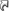
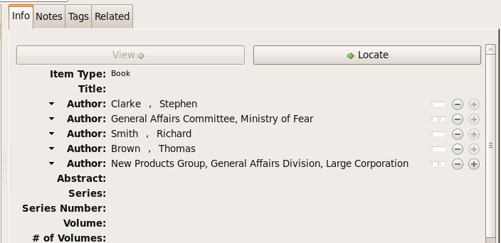
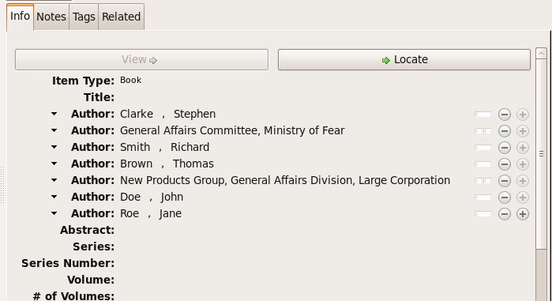

############################
``citeproc-js``
############################
||||||||||||||||||||||||||||||||||||||||||||
:small-caps:`CSL-m` Specification Supplement
||||||||||||||||||||||||||||||||||||||||||||

.. class:: fixed

   `CitationStylist.org`__

__ http://citationstylist.org/

.. class:: contributors

   Frank G. Bennett, Jr.

.. class:: date

   September 29, 2011

.. |citeproc-js| replace:: ``citeproc-js``

.. |ndash|  unicode:: U+02013 .. EN DASH
.. |mdash|  unicode:: U+02014 .. EM DASH
.. |para|   unicode:: U+000B6 .. PILCROW SIGN

========

.. contents:: Table of Contents

========

========
Overview
========

This document is a companion to the `CSL 1.0 Specification`__, for use by
style authors making use of extensions to the CSL language available
in citeproc-js.

__ http://citationstyles.org/downloads/specification.html

======================================
Numeric variables |(approved for CSL)|
======================================

In CSL 1.0, ``chapter-number``, ``collection-number`` and ``number-of-pages``
were not classified as number variables, and so could not be used with the
``cs:number``.

The development version of the official CSL schema has been amended
to add ``chapter-number``, ``collection-number`` and ``number-of-pages``
to the set of numeric variables. See
`the list of number variables`__ in the CSL Specification source text.

__ https://github.com/citation-style-language/documentation/blob/master/specification.txt#L2266

The MLZ extended schema reflects this change.

======================================================
``cs:label`` for number variables |(approved for CSL)|
======================================================

In CSL 1.0, only a subset of the cs:number variables were available for use
with the ``cs:label`` element, which provides automatic pluralization
of terms when the corresponding variable is plural.

The development version of the CSL schema permits all number variables to be used
with ``cs:label``. See `the description of the label element`__
in the CSL Specification source text.

__ https://github.com/citation-style-language/documentation/blob/master/specification.txt#L1204

The MLZ extended schema reflects this change.

=============================================
``title-short`` variable |(approved for CSL)|
=============================================

In CSL 1.0, titles can be rendered in short form, using the
value (in Zotero) of the "Short title" field. However, there is
no means of testing whether a short title exists for an item,
which is required by some styles.

This has been remedied in the development version of the official CSL
schema by the addition of a ``title-short`` variable, which may be
tested for on ``cs:if`` and ``cs:else-if`` elements.

The MLZ extended schema reflects this change.

========================================================
Gender-sensitive ordinals and terms |(approved for CSL)|
========================================================

CSL 1.0 provided for localization of ordinal terms, but
without support for languages in which the form of an
ordinal varies according to the gender of its subject.

The development version of the CSL schema has been amended
to provide such support. The official description can be
found in the draft source of the `CSL Specification`__, but
a brief description is provided below.

__ https://github.com/citation-style-language/documentation/blob/master/specification.txt

For languages in which the ordinal suffix to days varies
according to the subject to which they apply the MLZ extended
schema offers a means of linking the gender form of terms to the
gender of the related noun. An example:

.. sourcecode:: xml

   <term name="edition" gender="feminine">
     <single>édition</single>
     <multiple>éditions</multiple>
   </term>

   <term name="month-01" gender="masculine">janvier</term>

   <term name="ordinal-01" gender-form="feminine">re</term>
   <term name="ordinal-01" gender-form="masculine">er</term>
   <term name="ordinal-02">e</term>
   <term name="ordinal-03">e</term>
   <term name="ordinal-04">e</term>

With the code above set in the locale, rendering the date
"2001-01-01" in its full text form might yield (the ordinal set on
the day is in this case is controlled by the month, a logic
built into the processor):

   1er janvier 2001

If an labeled edition number is rendered as an ordinal, it
might come out something like this:

   1re éd.

==========================================================
``subsequent-author-substitute-rule`` |(approved for CSL)|
==========================================================

The ``subsequent-author-substitute-rule`` attribute is a companion
for use with ``subsequent-author-substitute``. Use it to control
the method of applying the substitution slug:

``complete-all`` (default)
   if the names in a name variable completely match
   those in the preceding bibliographic entry, the value of subsequent-author-
   substitute substitutes once for all rendered names.

``complete-each``
   if the names in a name variable completely match those in
   the preceding bibliographic entry, the value of subsequent-author-substitute
   substitutes for each rendered name.

``partial-each``
   if one or more names in a name variable match those in the
   preceding bibliographic entry, the value of subsequent-author-substitute
   substitutes for each rendered matching name (matching starts with the first
   author, and continues up to the first mismatch)..

``partial-first``
   same matching behavior as above, but substitution is limited to the
   first name in the nameset.

================================================================
Courts, institutions, and media-neutral citations (working note)
================================================================

There are some extremely thorny issues in the citation of legal cases
that are going to treat us to some jarring speed bumps.

Parallel citations have been addressed in ``citeproc-js`` already, and
the code for handling them is reasonably well tested. When we turn
this code loose on a range of real-world content and styles, however,
we may find that it needs some turning. The code and the processing
flow is arcane and difficult, because it involves implicit logic based
on field content across successive cites, with on-the-fly removal of
elements *after* the cites have been cast into the processor's
internal representation, and before serialization. If the tuning work
gets too hairy, I may be in for some refactoring of this code to make
it more transparent. So I'm fastening my seat belt for that prospect
as I write this.

"Media-neutral" or "universal" citations are a new thing in legal
citation styles, that are catching on in multiple jurisdictions and
citation styles.  Their essential characteristic is not actually media
neutrality, but the fact that they represent text published directly
by the court, without a private publishing intermediary.  They are a
special problem in several ways:

* Different formatting may be required for such cites, so we need to
  cast them as input data in a way that allows them to be readily
  identified without relying on field-testing tricks that may vary
  between jurisdictions.

* Media-neutral/universal cites, and possibly traditional cites as
  well, need to treat the court and its division as a unit in some
  styles (composing a single "reporter" string that encapsulates
  both) and separately in others (with court and division rendered
  in separate locations). This is a hard problem with only messy
  solutions if the data is spread across multiple fields.

* Media-neutral/universal cites need to play well with traditional
  cites when rendered in parallel. About the only thing we can depend
  on is that the media-neutral/universal cite appears as the first
  in the series.

* The presence of a media-neutral/universal cite at the start of
  a parallel series can affect the content that appears in subsequent
  traditional cites in the series. The known case of this is the court
  division in OSCOLA cites, documented at section 2.1.1 of the OSCOLA
  guide.

Looking at the issues, I'm thinking that something like the following
might allow us to thread the needle on this:

Set court as ``original-author`` on legal_case
    If courts themselves are set as institutional authors on
    the legal_case type, we can leverage the representation
    of the court/division information as a unitary key
    in the Abbreviations mechanism, rendering the elements
    as a unit where the full string is recognized as a single key,
    and as separate subunits when they are recognized individually.
    Some changes in the processor will be needed to make this
    work, but it's very doable.

Extend implicit logic in parallel cite rendering
    To suppress court and subdivision details where they
    are supplied by an initial media-neutral/universal cite,
    the parallel citation collapsing mechanism would need to be
    tuned with hard-wired logic for that purpose. I don't much like
    this, but it is limited to the ``legal_case`` and ``statute`` types,
    and should be controllable.

Change the input order of institution name subelements
    Currently institutions are *big-endian*, with the largest institutional
    subunit at the end. This is inconvenient in a UI that sorts on the
    raw name string, since the subelements are not clustered together.
    For useability in simple systems, this ordering should be reversed.
    The marginal pain of this is relatively small at this point, since
    \(a) Zotero does not yet recognize institutional authors, and (b)
    we've just very recently changed the subfield delimiter to ``|`` anyway.
    If institution names are going to be heavily used in this way,
    this change really should be made.

=============================================
``skip-words`` attribute to ``style-options``
=============================================

Different languages treat different words as noise words when
sorting or making text-case adjustments. The processor defines
a default set of these words. The ``skip-words`` attribute
permits the list to be reset for a given locale.

===============================================
``cs:number``, ``cs:label``, and ``is-numeric``
===============================================

.. admonition:: Important

   The implementation described in this section has been simplified
   in ``citeproc-js``. Please stand by (for a week or two),
   pending an update to this documentation.

The ``citeproc-js`` processor is able to process multiple number
values in the ``cs:number`` element, performing range collapsing
applying appropriate joins to the list, and appending ordinal
suffixes to each element if requested.

The extension is intended to be unintrusive, handling legacy input as
expected (or with minimal changes that are simple to adjust for in the
Zotero field entry), while permitting more sophisticated handling with
a little more discipline in the format of field data. An outline of the
parsing logic follows. The examples assume CSL code like the
following:

.. admonition:: Hint

   This extended facility
   is only enabled for numeric variables: it does not affect the
   behavior (in formatting or pluralization) of the non-numeric
   variables available for use with ``cs:number`` (``locator``,
   ``page`` and ``page-first``).

.. sourcecode:: xml

   <group delimiter=" ">
     <number variable="edition"/>
     <choose>
       <if is-numeric="edition"/>
         <label variable="edition"/>
       </if>
     </choose>
   <group>

--------------
Single numbers
--------------

If the input string contains a single number and no more than one
non-numeric descriptor, then:

* If the input contains no descriptor, it is formatted in the form
  specified, and ``is-numeric`` evaluates true.

* If the leading characters, lowercased, of the descriptor match the
  lowercased characters of the first word of the short-form singular
  form of the corresponding term in the current locale (with periods
  stripped) then the descriptor (if any) will be ignored, and the
  number will be processed as described above. **Note:** *This is a
  legacy data rescue mechanism; it is ordinarily safe and proper to
  place data in numeric fields without descriptors.*

* Where the entry contains a single descriptor that does *not* satisfy
  the conditions described above, the descriptor is assumed to be
  meaningful.  The field will be rendered literally, and
  ``is-numeric`` will evaluate false.

Where ``is-numeric`` evaluates true, the variables ``number-of-pages``
and ``number-of-volumes`` are treated as plural for numeric values
greater than ``1``, and singular otherwise. For other variables,
single number input is treated as singular.

The sample CSL above would produce the following results:

===================  ======================
Input                Output
===================  ======================
``1``                1st edition
``Edition 3``        3rd edition 
``2 (edition)``      2 (edition)
``Folio 1``          Folio 1
===================  ======================
    

----------------
Multiple numbers
----------------

Multiple numbers are recognized if delimited by a space, a comma, or
an ampersand, or a hyphen. A hyphen is recognized as a range delimiter
in the input, and will be treated as the full series of numbers.
Both the hyphen and ampersand delimiters must be surrounded by
whitespace on both sides.  If the numbers are unadorned, they will each be
transformed according to any ``form`` attribute set on ``cs:number``
after sorting, resolution of any overlaps, and range collapsing:

================  ===========================================
Input             Output
================  ===========================================
``2 1``           1st & 2nd editions
``1 - 5 & 3, 6``  1st-6th editions
================  ===========================================

--------------------
Numbers with affixes
--------------------

For numbers that have any non-numeric prefix, or a suffix containing
punctuation or a hyphen, ``is-numeric`` test true, but the content is
passed through in its literal form. Where multiple number elements
exist (with or without affixes) the string is treated as plural.

Where a non-numeric descriptor is present in such input,
''is-numeric`` tests false, and pluralization is irrelevant.

================  ============================
Input             Output
================  ============================
``12nd``          12th edition 
``12a-c``         12a-c edition
``12:xx``         12:xx edition
``T51``           T51 edition
``T51 & T53``     T51 & T53 editions
``T51 edn.``      T51 edn.
================  ============================

--------------------
Multiple descriptors
--------------------

As indicated above under `Multiple numbers`_ and `Numbers with
affixes`_, numbers with affixes are treated as non-numeric if
accompanied by a single non-numeric descriptor.

For fields containing a single number, ``is-numeric`` always evaluates
``false`` if the field contains *more than one* non-numeric
descriptor.  Such fields are rendered literally, without change:

=======================     ============================
Input                       Output
=======================     ============================
``12nd edn. (reissue)``     12th edn. (reissue)
=======================     ============================

=======================
``cs:generate`` element
=======================

In lists of authorities, cross-reference entries are often provided
for the convenience of the reader. The ``cs:generate`` element can
be used to add cross-reference or supplementary entries derived from
the content of an item. As currently implemented in ``citeproc-js``,
``cs:generate`` accepts the following attributes:

type-map [required]
      This attribute takes a list of exactly two item types. The first-listed
      type is a constraint; no item will be generated unless the item type
      of the input item matches the first-listed type. The second-listed
      type is a mapping. The generated item will carry this type. The first
      and the second listed types may be identical, but both must be provided.

trigger-fields [currently required]
      The trigger-fields attribute is list of fields that must be present on
      the item for an entry to be generated. The fields in the list will be
      removed from the item before rendering.

Other transforms rules to complement ``trigger-fields`` may be introduced
in future. At that time, ``trigger-fields`` will become one option within
the set of rule attributes.

Any ``cs:generate`` elements must appear as the first elements with
the ``cs:layout`` under ``cs:bibliography``. An example follows:

.. sourcecode:: xml

   <bibliography>
     <sort>
      <key macro="sortkey"/>
     </sort>
     <layout>
       <generate type-map="legal_case legal_case" trigger-fields="title-short"/>
       <text macro="oscola-bib-case"/>
     </layout>
   </bibliography>

The construct above is used in the draft OSCOLA legal style to generate
cross-reference entries for shipping and trademark cases.

===================================================
``locator-date`` and ``locator-revision`` variables
===================================================

The variable "locator-date" is parsed out from the user-supplied
locator, using the following syntax:

.. sourcecode:: csh

   123|2010-12-01

In this example, "123" is the value of the ``locator`` variable
(a page or other pinpoint string), the ``|`` character marks the
end of the pinpoint, and the ten-character string immediately
following is a full date. If supplied, dates must be given as shown above,
zero-padded, in year-month-day order, and with no space between
the date and the ``|`` character. Non-conforming strings following
the ``|`` marker will be treated as a ``locator-revision`` variable.

The ``locator-revision`` variable consists of a string that is not a
date, following the ``locator-date`` string (if any) as described
above.  If supplied without a ``locator-date``, the
``locator-revision`` string must be preceded by a ``|`` field
separator character.  This variable can be used for version
descriptions associated with some looseleaf services.

These extensions are useful with looseleaf services, because the dates
of the content in these services varies depending on the page cited
and the time at which the resource was referenced. These extensions
permit a single item in the calling application's database to
represent the volume on the library shelf, the page date being
optionally supplied by the user when citing into a document.

================================
``supplement`` term and variable
================================

The ``supplement`` variable and associated locale term is useful
for secondary sources that are regularly updated between fresh
editions. Such fine-grained updates are found in secondary
legal publications.

========================
``periodical`` item type
========================

The ``periodical`` item type can be used to refer to a serial
as a whole. It should also be used for the looseleaf services 
found in legal publishing, as these often require citation formatting
that differs from that of a book.

==================================
``minimal-two`` page collapse rule
==================================

The OSCOLA style (and possibly others), requires that numeric ranges
be collapsed to the minimum number of characters that express the
range unambiguously, but always with at least two characters (if present)
on the second element of the range. This rule for use with the 
``page-range-format`` attribute implements that behavior.

When in force, this rule is also applied to year ranges.

=======================================
Extensible number term |(multilingual)|
=======================================

This variance permits additional localized ``number`` terms to be defined
in the style locale, distinguished by a hyphen and two-digit numeric
extension:

.. sourcecode:: xml

   <term name="number">number</term>
   <term name="number-01">UN document number</term>
   <term name="number-02">WTO document number</term>

As the example above suggests, the ability to define such extended
terms is useful together with the conditional test for ``jurisdiction``
(see below), as it allows document numbers to be identified
to the issuing authority, as legal styles often require.

This feature is marked as requiring the MLZ multilingual client, not
because extended ``number`` terms are incompatible with the official
Zotero client, but because it is not useful without the
``jurisdiction`` variable, and that can currently be defined only in
the multilingual version.

========================
Extensible ordinal terms
========================

Some languages have different rules than English for applying
ordinal suffixes to numbers. CSL 1.0 provides only four ordinal
suffix terms, as required for English ("st", "nd", "rd" and "th").
To support ordinal suffixes for a larger set of languages, a more
flexible algorithm is being prepared, which will be controlled
by providing extended ordinal terms with appropriate values in
the locale.

This functionality comes to us from Sylvester Keil, author of the
``citeproc-ruby`` CSL processor. It has not yet been implemented
in ``citeproc-js``, but the extended schema has been amended to
open the way for its introduction. When it is ready, documentation
on its use will be provided here (or in the official CSL schema,
if extended ordinal terms are approved for adoption).

===============================
Normalized punctuation in names
===============================

CSL 1.0 normalizes punctuation when names are converted to
initials with the ``initialize-with`` attribute on ``cs:name``.
When initials are present in names that are *not* converted to
initials, however, normalization is not performed.

The MLZ extended schema fills this gap by providing an ``initialize``
attribute that may be set to either true or false. The default is
true (perform initialization). When set to false, names are not
converted to initials, but initials that already exist in the full
form of the name are normalized, using the value set on ``initialize-with``.
For example:

.. sourcecode:: xml

   <names variable="author">
     <name initialize="false" initialize-with="."/>
   </names>

With the code above, a name entered with "Marcus Ts. J W" as the
given name, and "Blaggyfuddle" as the family name will be rendered
as:

   Marcus Ts. J.W. Blaggyfuddle

==================================
Institution names |(multilingual)|
==================================

Institutional names are fundamentally different in structure from
personal names. CSL provides quite robust support for the presentation
and sorting of personal names, but in CSL 1.0, institutional names
have just one fixed form, and are otherwise treated the same as
personal names in a list of creators.

Some publishing environments require greater flexibility.  Institution
names can consist of multiple subunits. Individuals may be credited
together with the institution to which they belong. Unaffiliated
personal authors may be cited together with an institution or with
individuals affiliated with it.  Some examples:

1. Research & Pub. Policy Dep't, Nat'l Urban League
2. United Nations - ECLAC
3. ECLAC (Economic Commission for Latin America and the Carribean)
4. Canadian Conservation Institute (CCI)
5. Nolan J. Malone and others, U.S. Bureau of the Census
6. World Trade Organization and World Health Organization
7. Smith with Jones, Bureau of Sloth, Ministry of Fear
8. Doe et al. with Roe et al., Ministry of Fear & Noakes, Ministry of Destruction

Examples 3 and 4 render both the full form and the acronym of a single
institution name, with arbitrary ordering of the two name parts.
Example 1 begins with the smallest subunit in a list of related
institutions, and example 2 does the opposite.  Examples 1 and 2 are
pure organizations, while example 5 is a mix of personal and
institutional names.  Examples 1, 2, 3 and 4 would be entered as
literal strings currently, which has obvious drawbacks.  Example 5
would require that the authorship information be spread across two
variables, although all parties listed are equally authors of the
resource.  Example 6 can be produced in CSL 0.8, but examples 7 and 8
cannot.

The MLZ extensions to CSL 1.0 provide a cs:institution element, which
can be used to produce any of the above forms, without interfering
with the formatting of ordinary personal names. The extension is
always enabled in |citeproc-js|, but the application calling
|citeproc-js| (i.e. Zotero) must specially flag institutional names
for it to take effect. MLZ provides this flag, while the official
Zotero client does not. For this reason, this extension only works
with the multilingual client at present.

-----------------
Entry conventions
-----------------

In multilingual Zotero, names entered in two-field mode are personal,
and those entered in single-field mode are treated as
organizations. Names should be entered in the order in which they
should appear in citations, with one (extremely rare) exception: when
an unaffiliated author is included in a list of names that includes
one or more institutions, the name of the unaffiliated author(s)
should come *after* that of the last institution in the list.

Subunits of an organizational name should be separated with a
field separator character ``|``.

^^^^^^^^^^^^^^^^^^
Affiliated authors
^^^^^^^^^^^^^^^^^^

Single or multiple personal Names that are co-authors with an
organization would be entered above the relevant organization name.

In a very simple style, the sample above might be rendered as: *Clarke,
Ministry of Fear and Smith & Brown, Large Corporation*.

^^^^^^^^^^^^^^^^^^^^
Unaffiliated authors
^^^^^^^^^^^^^^^^^^^^

Authors with no affiliation would be listed after any organizational
names:

In a very simple style, the sample above might be rendered as: *Doe &
Roe with Clarke, Ministry of Fear and Smith & Brown, Large Corporation*
(note the reverse ordering in this case, with the names at the end
placed at the front of the rendered list of names). 

The structure of mixed personal and organizational names can thus be
expressed in the current Zotero UI. We now turn to the extended
CSL syntax used to control the appearance of such names.

-------------
CSL Extension
-------------

^^^^^^^^^^^^^^^^^^^^^^^^^^^
Element: ``cs:institution``
^^^^^^^^^^^^^^^^^^^^^^^^^^^

A ``cs:institution`` element can be placed immediately after the
``cs:name`` element to control the formatting of organization
names. 

~~~~~~~~~~~~~~~~~~~~~~~~~~~~~~~~~~~~~
Attributes: ``delimiter`` and ``and``
~~~~~~~~~~~~~~~~~~~~~~~~~~~~~~~~~~~~~

The value of the ``delimiter`` attribute on ``cs:institution``
is used in the following locations:

* between organization names;
* between the subunits of an organization;
* between affiliated authors and their institution.

The ``and`` attribute on ``cs:institution``, if any, is used for the
final join between two or more author/organization units.

A simple use of ``cs:institution`` might read as follows:

.. sourcecode:: xml

   <names variable="author">
     <name and="symbol" initialize-with=". "/>
     <institution and="text" delimiter=", ">
   </names>

With this CSL, all of the delimiters in the following string would be
drawn from attributes on ``cs:institution``: *R. Smith, Small
Committee, Large Corporation, G. Brown, Busy Group, Active Laboratory,
and S. Noakes, Powerful Ministry*.

~~~~~~~~~~~~~~~~~~~~~~~~~~~~~~~~~~~~~~~~~~~~~~~~~~~~~~~~~~~~~~~~~~~~
Attributes: ``use-first``, ``substitute-use-first`` and ``use-last``
~~~~~~~~~~~~~~~~~~~~~~~~~~~~~~~~~~~~~~~~~~~~~~~~~~~~~~~~~~~~~~~~~~~~

To control the omission of names from the middle of the list of
organizational subunits, either of ``use-first`` or
``substitute-use-first`` may be used to pick names from the front of
the list. The ``use-last`` attribute picks names from the end.  The
``substitute-use-first`` attribute includes the leading (smallest)
subunit if and only if no personal names are associated with the
organization.

The following CSL code would format both example 1 and example 5 from
the list of samples at the top of this section:

.. sourcecode:: xml

    <names variable="author" delimiter=", ">
        <name 
          and="symbol" 
          delimiter-precedes-last="never"
          et-al-min="3"
          et-al-use-first="1"/>
        <et-al term="and others"/>
        <institution 
          delimiter=", "
          substitute-use-first="1"
          use-last="1"/>
    </names>

~~~~~~~~~~~~~~~~~~~~~~~~
Attribute: reverse-order
~~~~~~~~~~~~~~~~~~~~~~~~

By convention, organizational names are rendered in "big endian"
order, from the smallest to the largest organizational unit.  To
provide for cases such as example 2 in the list of samples, a
``reverse-order`` attribute can be applied on ``cs:institution``:

.. sourcecode:: xml

    <names variable="author" delimiter=", ">
        <name/>
        <institution 
          delimiter=" - "
          use-first="1"
          use-last="1"
          reverse-order="true"/>
    </names>
    
~~~~~~~~~~~~~~~~~~~~~~~~~~~~
Attribute: institution-parts
~~~~~~~~~~~~~~~~~~~~~~~~~~~~
    
The components of organization names are normally rendered in their
long form only.  When the `Zotero Abbreviations Gadget`__ is used
with Zotero, abbreviated forms for these names may be available
to the processor.

To use the short form, or combinations of the long and short form, an
``institution-parts`` attribute is available on ``cs:institution``.
The attribute accepts values of ``long``, ``short``, ``short-long``
and ``long-short``.  This attribute would be used to produce examples
3 and 4 in the list of samples, with values of ``short-long`` and
``long-short`` respectively.  A value of ``short`` behaves in the same
way as ``form="short"`` in other contexts in CSL, using the short form
if it is available, and falling back to the long form otherwise.

__ http://onezotero.org/tools/

^^^^^^^^^^^^^^^^^^^^^^^^^^^^
Element: cs:institution-part
^^^^^^^^^^^^^^^^^^^^^^^^^^^^

One or more cs:institution-part elements can be used to control the
formatting of long and short forms of organization names.  Like
``cs:name-part``, these elements are unordered, and affect only the
formatting of the target name element, specified (as on ``cs:name-part``)
with a required ``name`` attribute.

~~~~~~~~~~~~~~~~~~~
Attribute: if-short
~~~~~~~~~~~~~~~~~~~

In example 3, the parentheses should be included only if a short form
of the institution name is available.  The ``if-short`` attribute,
available on ``cs:institution-part`` only when applied to the long
form of an organization name, makes the formatting in the element
conditional on the availability of a short form of the name.  The
following CSL would render example 3 in the list of samples:

.. sourcecode:: xml

    <names variable="author">
        <name/>
        <institution institution-parts="short-long">
            <institution-part name="long" if-short="true" prefix=" (" suffix=")"/>
        </institution>
    </names>

^^^^^^^^^^^^^
Element: with
^^^^^^^^^^^^^

In rendered output, unaffiliated personal names are joined to a
following organizational name using an implicit localizable term
``with``.  Styling of this term is permitted through an optional
``cs:with`` element, placed immediately above ``cs:institution``:

.. sourcecode:: xml

    <names variable="author">
        <name/>
        <with font-style="italic" prefix=" " suffix=" "/>
        <institution institution-parts="short-long">
            <institution-part name="long" if-short="true" prefix=" (" suffix=")"/>
        </institution>
    </names>

^^^^^^^^^^^^^^^^^^^^
Simple style example
^^^^^^^^^^^^^^^^^^^^

The simple style used in the illustrated examples in the `Entry conventions`_ section
above would look like this in CSL:

.. sourcecode:: xml

    <names variable="author">
        <name form="short" and="symbol" delimiter=", "/>
        <institution use-last="1" and="text" delimiter=", "/>
    </names>

===========================================
``jurisdiction`` condition |(multilingual)|
===========================================

When citing primary legal resources, the form of citation is often
fixed, for ease of reference, by the issuing 
jurisdiction\ |mdash|\  "jurisdiction" referring in this case to
international rule-making bodies as well as national governments.
CSL 1.0 provides a ``jurisdiction`` variable, but it cannot be used
because Zotero does not currently have a corresponding field.

The particular requirement for this variable is that it be tested in a
``cs:if`` and ``cs:else-if`` condition, so that citations can be
varied according to the issuing jurisdiction. Testing of field content
is contrary to the design of CSL, so the approach of the MLZ extended
CSL schema is strictly circumscribed to address this particular need,
without opening a door to uncontrolled general testing of field
content that would be damaging to CSL as a language.

The solution is in two parts, described below.

-----------------
Jurisdiction list
-----------------

First, the CSL schema has been extended
in accordance with the proposed `URN:LEX`_ standard for a uniform
resource namespace for sources of law. This standard provides a
concept of "jurisdiction" that suits the requirements of legal
citation, including both national jurisdictions and international
rule-making bodies. Following `URN:LEX`_, the schema has been extended
with an explicit list of the national jurisdictions of the world, plus
selected rule-making international organizations designated by their
permanent domain name. The former are drawn from `ISO 3166 Alpha-2`_.
The latter do not yet have official sanction, as `URN:LEX`_ is still
at the proposal stage, but the list in the schema extension is
conservative, including only a few of the most stable (and widely
cited) organizations.

.. _`URN:LEX`: http://tools.ietf.org/html/draft-spinosa-urn-lex-03

.. _`ISO 3166 Alpha-2`: http://en.wikipedia.org/wiki/ISO_3166-1_alpha-2

-------------------------
The ``jurisdiction`` test
-------------------------

The list of acceptable jurisdictions codes is coupled with an
extension of the ``cs:if`` and ``cs:else-if`` elements, providing a
``jurisdiction`` test attribute. In styles, the value set on the
attribute *must* be present in the list of acceptable jurisdiction
values. A style that uses other values is invalid.

When the ``jurisdiction`` test attribute is used, its value is
compared with the value of the ``jurisdiction`` variable on the item
being processed. If the values match, the test returns true, otherwise
false.

The lack of a Zotero field for ``jurisdiction`` can be overcome in the
short term only in the multilingual client, using a workaround that is
not permitted in the official Zotero release. To set a value of ``ru``
on the CSL ``jurisdiction`` variable in the multilingual client, enter
the following in the **Extra** field of the item:

   {:jurisdiction: ru}

The field value will be extracted by the processor and set on the
item. If the style uses the **Extra** field for other purposes (which
is generally something to avoid), the braces and their content will be
removed before the field content is rendered.

====================
Multilingual layouts
====================

In publishing outside of the English language domain, citation
of foreign material in the style of the originating language
is the norm. For example, a Japanese publication might include
the following references in a single work:

* D. H. McQueen, "Patents and Swedish University Spin-off
  Companies: Patent Ownership and Economic Health", *Patent World*,
  March 1996, pp.22\ |ndash|\ 27.
* 北川善太郎「著作権法１００年記念講演会／著作権制度の未来像」コピーマート No.465, 7頁 (2000年)。

To meet such requirements, the MLZ extensions to CSL permit multiple
``cs:layout`` elements within ``cs:citation`` and ``cs:bibliography``.
Each ``cs:layout`` element but the last must include a ``locale`` attribute
specifying one or more recognized CSL locales, and the final element must
not carry a ``locale`` attribute. The locale applied to an item is determined
by matching it against the locale set in the ``language`` variable of
the item (this value is passed by Zotero). An example:

.. sourcecode:: xml

   <citation>
     <layout locale="en es de">
         <text macro="layout-citation-roman"/>
     </layout>
     <layout locale="ru">
         <text macro="layout-citation-cyrillic"/>
     </layout>
     <layout>
         <text macro="layout-citation-ja"/>
     </layout>
   </citation>

In the example above, an item with ``en``, ``es``
or ``de`` (or ``de-AT``) set in the ``language``
variable will be render by the ``layout-citation-roman``
macro, with locale terms set to the appropriate language.

====================================
Suppression based on number of names
====================================

In the MLZ extended schema, names can be suppressed in two ways.
First, using ``suppress-min`` and ``suppress-max`` with values of
``1`` or above, names rendered via a ``cs:name`` element can be
suppressed entirely when the number of individual names is at or below
a minimum, or at or above a maximum.

Second, with a value of ``0``, ``suppress-min`` can be used
on a ``cs:name`` *or* ``cs:institution`` element to suppress
*only* names of that type. See the description of ``suppress-min``
below for an example of how that works and why it might sometimes
be needed.

---------------------------
Attribute: ``suppress-min``
---------------------------

An example of ``suppress-min`` with a value of ``4``:

.. sourcecode:: xml

  <locale xml:lang="en">
    <terms>
      <term name="and others"></term>
    </terms>
  </locale>
  <macro name="first-position-author">
    <names variable="author">
      <name et-al-min="2" et-al-use-first="1" 
            suppress-min="4" 
            name-as-sort-order="first"/>
      <et-al term="and others"/>
    </names>
  </macro>
  <macro name="second-position-author">
    <names variable="author">
      <name et-al-min="4" et-al-use-first="1" delimiter=", "/>
    </names>
  </macro>
  <citation>
    <layout>
      <group delimiter=" / ">
        <group delimiter=" ">
          <text macro="first-position-author"/>
          <text variable="title"/>
        </group>
        <text macro="second-position-author"/>
      </group>
    </layout>
  </citation>

In the above example, an item with two authors will render as
follows:

   Stamou, A.I. Title of the Article / A.I. Stamou, I. Katsiris

An item with four authors, however, will render as follows:

   Title of the Article / A.I. Stamou et al.

^^^^^^^^^^^^^^^^^^^^^^^^^^^^^^^^^^^^^^
``suppress-min`` with a value of ``0``
^^^^^^^^^^^^^^^^^^^^^^^^^^^^^^^^^^^^^^

When set to zero, the ``suppress-min`` attribute is specific to the
``cs:name`` or ``cs:institution`` node only (for clarity, the
attribute with this value should always be set directly on the
affected node, rather than relying on inheritance).  The effect of the
setting is to suppress all institution or all personal names, leaving
a list of the remaining names in place.  This can be useful where
personal and institutional authors must be listed in separate places
in a citation\ |mdash|\ one example of such formatting being Rule
21.7.3 of the Bluebook 18th ed.  (applicable to U.N. reports) which
provides the following guidance and example:

    If a personal author is given along with the institutional
    author, the author [sic] should be included in a
    parenthetical at the end of the citation.

        U.N. Econ. & Soc. Council [ECOSOC], Sub-Comm. on Prevention
        of Discrimination & Prot. of Minorities, Working Group on
        Minorities, *Working Paper: Universal and Regional Mechanisms
        for Minority Protection*, |para| 17, U.N. Doc. E/CN.4/Sub.2/AC.5/1999/WP.6
        (May 5, 1999) (*prepared by* Vladimir Kartashkin).

---------------------------
Attribute: ``suppress-max``
---------------------------

.. sourcecode:: xml

   <macro name="authors">
     <group delimiter=" ">
       <names variable="author">
         <name name-as-sort-order="all"
               et-al-min="11" et-al-use-first="3"
               and="text"/>
       </names>
       <group delimiter=" " prefix="(" suffix=")">
         <names variable="author">
           <name suppress-max="10" form="count"/>
         </names>
         <text value="co-authors"/>
       </group>
     </group>
   </macro>
   <citation>
     <layout>
       <text macro="authors"/>
     </layout>
   </citation>

In this example, an item with four authors would render as
follows:

   Doe, J, Roe, J, Noakes, R, and Snoakes, H

An item with eleven authors, on the other hand, would 
render like this:

   Doe, J, Roe, J, Noakes, R, et al. (11 co-authors)

